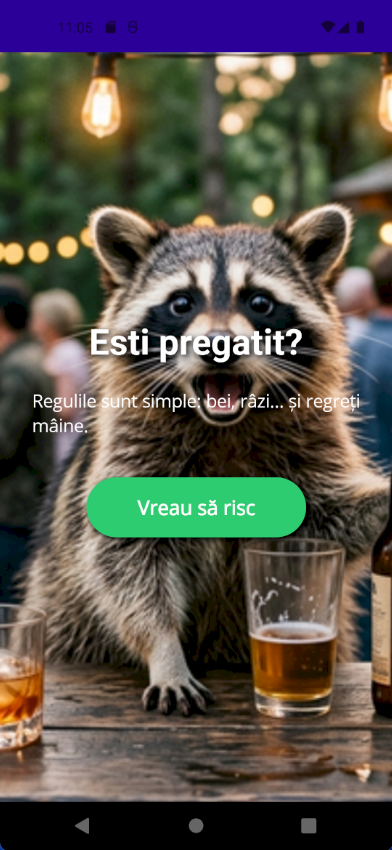
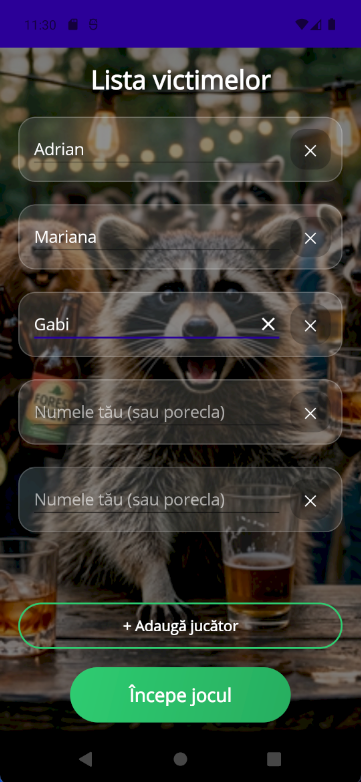
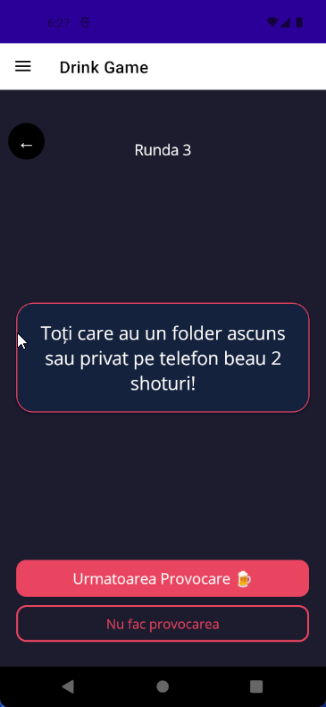
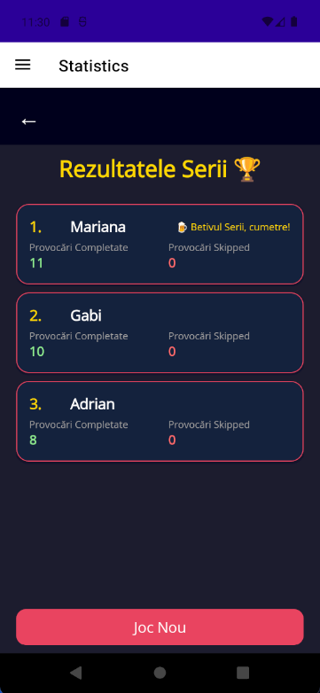
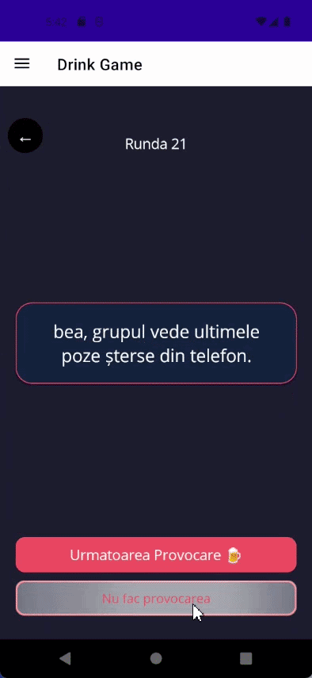

#  DrinkGame

> A Romanian party drinking game for Android & iOS, built with .NET MAUI.  
> Features 150+ challenges, a spin wheel, per-player statistics, and a chaotic good time.

---

##  Screenshots

|  |  |  |  |


## Features

-  **150+ challenges** across 5 difficulty levels (1–5 )
-  **Spin wheel** with 4 special categories (3% chance per round)
-  **Multi-player** — add any number of players before starting
-  **End-of-game statistics** — ranked leaderboard with special titles
-  **Skip button** — opt out of a challenge (tracked in stats)
-  **Quit protection** — confirmation dialog prevents accidental exit
-  **Wheel spin sound effect**

---

##  Spin Wheel Categories

 

---

##  End-of-Game Awards

| Award | Description |
-
| Most challenges completed |
| Most challenges skipped |

---

## 🛠️ Tech Stack

| | |
|---|---|
| **Framework** | .NET MAUI (net10.0) |
| **Architecture** | MVVM — `CommunityToolkit.Mvvm` |
| **Audio** | `Plugin.Maui.Audio` 4.0.0 |
| **UI Toolkit** | `CommunityToolkit.Maui` 14.1.0 |
| **Language** | C# 13 / XAML |
| **Platforms** | Android, iOS, macOS Catalyst, Windows |
| **Min Android** | API 21 (Android 5.0+) |
| **Min iOS** | 15.0 |

---

##  Getting Started

### Prerequisites

- [Visual Studio 2022](https://visualstudio.microsoft.com/) with **.NET MAUI workload** installed
- .NET 10 SDK
- Android SDK (API 21+) for Android target
- Xcode 15+ for iOS/macOS target (Mac only)

### Run locally

```bash
git clone https://github.com/YOUR_USERNAME/drinkgame.git
cd drinkgame
```

Open `drinkgame.sln` in Visual Studio 2022, select your emulator/device and press **F5**.

All NuGet packages restore automatically on first build.

---

##  NuGet Dependencies

```xml
<PackageReference Include="CommunityToolkit.Maui"              Version="14.1.0" />
<PackageReference Include="CommunityToolkit.Mvvm"              Version="8.4.2"  />
<PackageReference Include="Plugin.Maui.Audio"                  Version="4.0.0"  />
<PackageReference Include="Microsoft.Maui.Controls"            Version="10.0.41"/>
<PackageReference Include="Microsoft.Extensions.Logging.Debug" Version="10.0.0" />
```

---

##  Project Structure

```
drinkgame/
├── Models/
│   ├── GameModels.cs           # Player model (Name, ChallengesCompleted, ChallengesSkipped)
│   └── GameState.cs
├── ViewModels/
│   ├── GameViewModel.cs        # Core game logic, challenge pools, wheel spin
│   ├── PlayerNamesViewModel.cs # Player name entry & validation
│   └── StatisticsViewModel.cs  # End-of-game ranking calculation
├── Views/
│   ├── MainPage.xaml           # Start screen
│   ├── PlayerNamesPage.xaml    # Player setup
│   ├── GamePage.xaml           # Main game screen
│   └── StatisticsPage.xaml     # Results & awards
├── Converters/
│   ├── InverseBoolConverter.cs
│   ├── GroupChallengeColorConverter.cs
│   └── RoundToProgressConverter.cs
├── Resources/
│   ├── Images/
│   │   ├── bereaa.png          # Main menu background
│   │   ├── raccoon_party.png   # Player setup background
│   │   └── wheelspin.png       # Spin wheel graphic
│   ├── Raw/
│   │   └── wheel_spin.mp3      # Spin sound effect
│   └── Fonts/
│       └── Bangers-Regular.ttf
└── MauiProgram.cs              # DI registration & app bootstrap
```

---

##  How to Play

1. Open the app → tap **"Vreau să mă risc"**
2. Enter all player names → tap **"Începe jocul"**
3. Each round a random player gets a challenge
   - **"Următoarea Provocare"** → completed  (counts toward stats)
   - **"Nu fac provocarea"** → skipped  (counts toward stats)
4. Occasionally (3% chance) the  **spin wheel** appears for a special category
5. After **30 rounds**, see who is the **Betivul Serii**  and who chickened out 

---

##  Disclaimer

This app is intended for **adults (18+)**. Please drink responsibly.  
Never drink and drive. The developers are not responsible for regrettable texts, lost bets, or existential crises caused by spin wheel results.

---

##  License

MIT — fork it, mod it, use it for your own party nights. 

---
